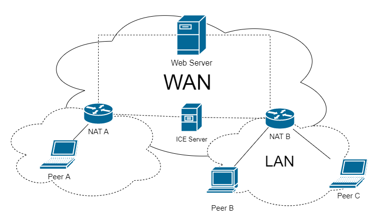
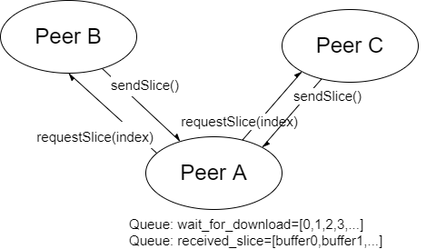

# WEB-BASED P2P FILE SHARING SYSTEM
This is a P2P file sharing system implemented by Flask. All peer operations are performed on a web page. **Only tested in Chrome kernel browser on win10.** If you meet any problems please try to change the environment and contact me([wenrui.liu@ucdconnect.ie]()).


## Features
### Functions have been implemented
- **Resources tracker:** The server records the resource information shared by the peer and tracks it. When a new peer obtains the resource, the server actively expands the tracker of the resource. If no peer owns the resource, the server deletes the information and tracker of the resource.
- **Chunk verify:** When the peer has turned on transfer verify, files will be partitioned for hash Verify to ensure that the data is accurate and not retransmitted entirely.
- **Multi-source/multi-channel download:** Multiple P2P connections are established at the same time to transfer a file to maximize the transmission speed and evenly share the bandwidth pressure of the P2P network.
- **Breakpoint resume:** If the download is interrupted due to special circumstances, the peer will keep the incomplete data and continue the transmission after re-establishing the connection.
- **Nat across(maybe):** The SDP protocol allows peers to carry out NAT across with the help of ICE Server. This project uses a public STUN server([stun.stunprotocol.org]()) to allow peer-to-peer connections under different NATs. But across may fail due to the type of the NAT.

### Advantages
- **Easy to use:** All tasks are done on the Website, and you don't need to download any plug-ins to set up a P2P transfer.
- **Robust:** Multi-peer connection and multi-channel design greatly improve the stability of P2P network. Download nodes will be automatically allocated in the most reasonable way for each download, you do not need to worry about download interruptions.

### Problems to be solved
- **Transmission speed limit:** Some browsers seem to limit the speed of P2P connections to around 2Mb/s over a LAN.
- **File size limit:** Due to security restrictions of the browser, the download party cannot write the obtained file data to hard storage in real time. It can only be stored locally after the download is complete. Therefore, it is not very friendly for devices with small memory.
- **Poor support for mobile devices:** The communication quality of mobile devices is worse than that of PC, which is reflected in transmission speed, connection establishment and other aspects.

## Quick start
The demo is now available on [http://peeeer.com]() and a backup on [http://123.57.9.167](). Please contact me ([wenrui.liu@ucdconnect.ie]()) if the website collapsed.

If you want to deploy on your own environment, please following the instruction below.

download requirements:
```shell
pip install -r requirements.txt
```

build database:
```
flask shell
> from app import db
> db.create_all()
```

start server:
```shell
python app.py
```

Then open [http://127.0.0.1](), you can use this page to share your file or download file.

## Using instruction
### Share a file
- Click the File Input button to select the file you want to share.
- If you want to ensure that file data is transferred correctly, check verify before selecting the file. This will add MD5 verification during file transfer. (Generally, it is not necessary to check, WebRTC has ensured the accuracy of data transmission, and no data error occurred in all my tests)
- Send your file id or copy url to your friends. They can download it by using it.
- You can see it and manage it in the file table.

### Download a file
- Enter the file ID in the input box, then click on request button. Or just go to the URL a friend shared with you.
- You can monitor the download progress and speed in the Download table. You can click on "abort" to end the download or "refresh" to re-establish the transport channel in the Option column.
- When the download is complete, you will see it in the File table. Click "Download" and it will be saved locally. If you do not remove it from the table, others will also be able to access the resource through you.

## System design

### Overview
- **Web server:** Responsible for providing peer page, maintaining UHPT, UHRT database and switching signaling.
    - Database: A sqlite database contains peer, res and peer2res table. Peer table records the GUID and routing metrics of all online peers. Res table records the GUID, name, size, and MD5 of files in the P2P network. Peer2res tracks the propagation of resources between peers.
- **ICE server:** Assist peer NAT across. It only works if the two peers are not in the same LAN.
- **NAT:** Gateway from the subnet to the WAN.
- **Peer:** Every node in a P2P network. In this project, peer is a web page assisted by the browser to establish P2P connections, also maintain a DHRT record of the files you add or download.

### Implementation
- **Add peer:** When the website is loaded, a websocket is established to web server, and the web server will generate a GUID, records it in peer table, and returns the GUID to the peer.
- **Add resource:** Add a local file and upload the file information to the server. If file verification is enabled, the peer will calculate the MD5 value for the file and uploads the file to the server. After receiving file, the server randomly generates the GUID, saves the file to its UHRT, starts tracing the resource, and returns the generated GUID. After receiving the GUID, the peer records the file to its DHRT.
- **Get resource:** Sends the GUID of the request resource to the server. The server retrieve all the peers with the resource from the database and returns the list of peers with higher routing metrics. After receiving the post-message, the peer establishes RTCPeerConnection with all candidate peers for P2P communication.
    - The process of establishing RTCPeerConnection also requires the assistance from web server, which acts as a signaling server and transmits negotiation information and ICE candidate information of both peers.
    - If the two peers that establish the connection are on the same LAN, the P2P connection has been completed after exchanging ICE candidates (Peer B and peer C in the figure above). Otherwise, the ICE Server is required to establish the connection (Peer A and Peer B in the figure above).
- **File transfer:** In order to ensure the transmission speed and share the pressure of each node in P2P network, file transfer adopts the design of multi-peer connection. The recipient will maintain the _wait_for_download_ and _received_slice_ queues during transmission. When the data channel is opened, the receiver will pop an element from the _wait_for_download_ queue and send the index of the element to the other end of the channel. After receiving the element, the sender will return the corresponding slice. If verify is enabled, the receiver will perform MD5 verification on the received slice, then the slice will be added to the _received_slice_ queue. If a channel has not received any messages for a period of time or has been receiving error messages for a long time, the channel will be closed and index is pushed to the _wait_for_download_ queue, waiting for another channel to re-download.



  
## Performance statistic
### Detail
- Server: centos 7; 2 cpu; 4G RAM; Locate HongKong; 1M bandwidth; Ping 130ms
- Peer: win10 Chrome/Edge
- Network: HUAWEI P30 4G hotspot

### Speed statistic
| receiver Info| sender Info | network | avg speed | max speed |
|:----:|:----:|:----:|:----:|:----:|
| 1 peer(Chrome) | 1 peer(Chrome)  | same device | 17Mb/s | 18.5Mb/s|
| 1 peer(Edge) | 1 peer(Edge) | same device | 17Mb/s | 18.5Mb/s|
| 1 peer(Edge) | 1 peer(Chrome) | same device | 26Mb/s | 28Mb/s|
| 1 peer(Chrome) | 1 peer(Edge) | same device | 26Mb/s | 28Mb/s|
| 1 peer(Chrome) | 1 peer(Chrome)  | LAN(mobile hotspot) | 1.5Mb/s | 2Mb/s|
| 1 peer(Edge) | 1 peer(Edge)  | LAN(mobile hotspot) | 1.5Mb/s | 2Mb/s|
| 2 peer(Chrome) | 1 peer(Chrome)  | LAN(mobile hotspot) | 1Mb/s | 1.2Mb/s|
| 1 peer(Chrome) | 2 peer(Chrome)  | LAN(mobile hotspot) | 2Mb/s | 2.5Mb/s|
| 1 peer(Chrome) | 1 peer(Chrome)  | WAN(mobile hotspot) | 1Mb/s | 1.5Mb/s|

### Server statistic
| operation | cost | 
|:----:|:----:|
|load page| 1000~2000ms |
|add resource| 150~250ms |
|get resource| 150~250ms |

### Other statistic
- Concurrent: Limited personal equipment, only 30 peers were tested at the same time, and no obvious delay was felt.
- Number of channels: After stability, each peer maintains about 15 channels for data exchange.
- Connection initialization cost: About 500~1000ms on PC. Mobile devices need more time to establish connections, and sometimes the establishment fails. The cause of this phenomenon has not been found yet.